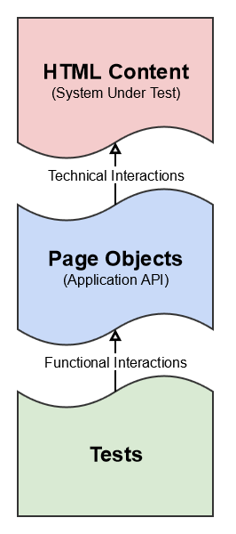

[Home](../README.md)

# Concepts and Principle of WebTester

> TODO Lorem Ipsum ...

## Page Object Pattern

WebTester is designed around the Page Object pattern. You model your web application's pages as objects and possible user interactions as methods. These page objects provide a stable layer between your tests and volatile HTML pages, making your tests much easier to maintain. Whenever you change the content on a web page, you simply update the corresponding page object, and all your tests will continue to work.

Page objects are declared by dividing your application into logical views. Each view should be distinct from all others and focus on the specific functionality provided by the application under test. In general this division is based on file boundaries (index.html, main.php, etc.). Some cases - like single page applications - are divided more along the boundaries of windows, dialogs, processes etc.

## Pages

> TODO Lorem Ipsum ...

## Page Fragments

> TODO Lorem Ipsum ...

## Interfaces instead of Classes

> TODO Lorem Ipsum ...

## Traits: Composition over Inheritance

> TODO Lorem Ipsum ...

## Nesting of Page Fragments

> TODO Lorem Ipsum ...

## Which Methods Where?

> TODO Lorem Ipsum ...
